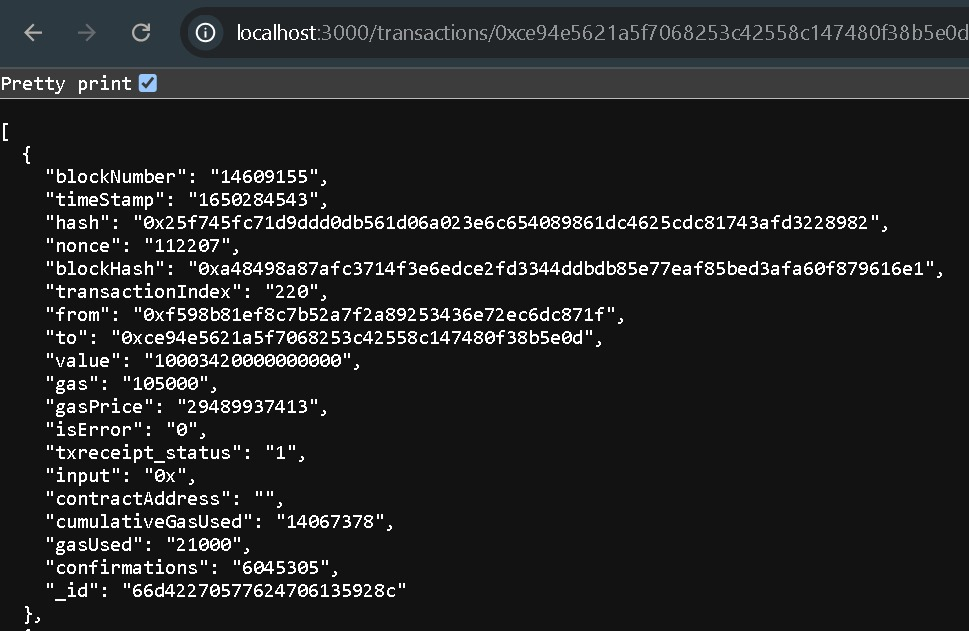
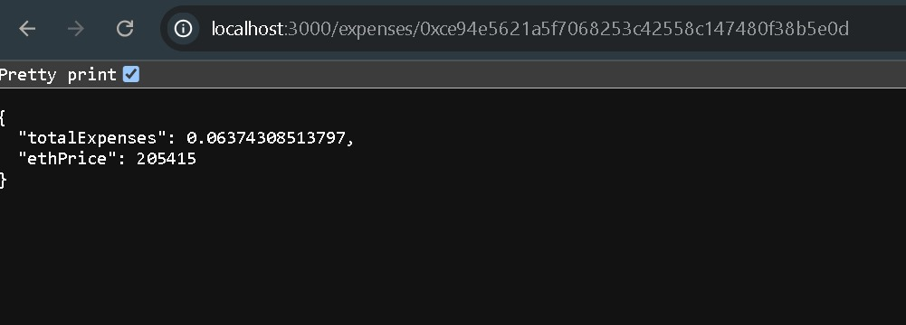

# backend
# Node.js Crypto Transactions and Ethereum Price API

This project includes a Node.js application that performs the following tasks:

1. **Fetches and Stores Crypto Transactions:** Uses the Etherscan API to fetch and store transactions for a given Ethereum address.
2. **Fetches and Stores Ethereum Price:** Fetches the price of Ethereum every 10 minutes using the CoinGecko API and stores it in the database.
3. **Calculates and Returns Total Expenses:** Provides an API to calculate and return the total expenses for a given Ethereum address, including the current price of Ethereum.

## Features

- **API for Transactions:**
  - Endpoint: `GET /transactions/:address`
  or in browser- `http://localhost:3000/transactions/0xce94e5621a5f7068253c42558c147480f38b5e0d`
  - Fetches transactions for the provided Ethereum address and stores them in MongoDB.
  
  
- **Periodic Ethereum Price Fetching:**
  - Fetches Ethereum price every 10 minutes and stores it in MongoDB.

- **API for Total Expenses:**
  - Endpoint: `GET /expenses/:address`
  in browser- `http://localhost:3000/expenses/0xce94e5621a5f7068253c42558c147480f38b5e0d`
  - Calculates the total expenses for the given address and includes the current Ethereum price in the response.
  

## Technologies Used

- **Node.js**
- **Express.js**
- **Axios** for HTTP requests
- **Mongoose** for MongoDB interaction
- **MongoDB** (hosted on MongoDB Atlas)
- **Node-Cron** for scheduling periodic tasks 
